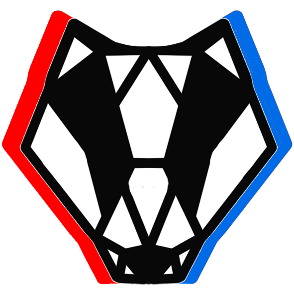

# COSC 4P02 Project 2022
A group project for Brock University's COSC 4P02 (Software Engineering 2).

### Chat Bot Application for Brock University and Canada Games
This project we developed is a web-based chatbot application that accomodates two distinct modes: one for Brock University and the other for Canada Games. We wanted to be able to provide a single website, where the user can ask questions that they have regarding that particular domain, i.e. Brock University or Canada Games, and be provided with meaningful answers. This may be a link to the resource or an actual answer so that the user doesn't need to hunt for that information. 

### Hosted Link
https://chatbot4p02.herokuapp.com/

## Tech Stack
For this project the primary technologies we used were:

| Technology | Usage |
| -------- | --------- |
| [Python](https://www.python.org/) | [Backend](./backend/), [Data cleaning](./backend/database/datapreprocessingcode/) |
| [Selenium](https://www.selenium.dev/) | [Webscraping](./backend/web-scraping) |
| [React/JavaScript](https://reactjs.org/) | [Frontend](./chatbot/src) |
| [Node Package Manager](https://www.npmjs.com/) | [Frontend](./chatbot/)|
| [Flask](https://flask.palletsprojects.com/en/2.1.x/) | [Server](./backend/server.py) |
| [SpaCy](https://spacy.io/) | [NLP](./backend/botNLP.py) |
| [SQLite](https://www.sqlite.org/index.html) | [Database](./backend/models.py) |
| [Flask-SQLAlchemy](https://flask-sqlalchemy.palletsprojects.com/en/2.x/_) | [Querying database](./backend/queryTables.py) |
| [PyTest](https://docs.pytest.org/en/7.1.x/) | [Testing](./backend/) |
| [Coverage](https://coverage.readthedocs.io/en/6.3.2/) | [Coverage](./backend) |
| [Docker](https://www.docker.com/) | [Containerization](./Dockerfile) |
| [Heroku](https://developer.salesforce.com/) | [Deployment](./heroku.yml) |

Other installs that are required to run the project can be found in the [requirements.txt](./backend/requirements.txt) file.

### Team Members:
- Greg Pogue 4583993 (Team Leader)
- Joel Jacob 6603245
- Madeline Janecek 6436620
- Sam Langdon 6180137
- Brendan Park 6541288
- Kylee Schram 6131726

### Backend
The backend folder of this project consists of the following folders.
- Database
    * `cleandata` folder: consists of the cleaned data that has been 
    scraped from various resources such as the Brock University and Canada Games websites.
    * `datapreprocessingcode` folder: consists of the python scripts written to clean and prepare the data for usage in the database.
    * The `.db` files are used to store the cleaned data.
    * The `_init.sql` files format the data into tabular format for the database.
    * The `input.py` files take the clean data and insert it into the database.
- NLP-Resources
    * This folder contains all files which the NLP code makes use of in order to accurately understand and respond to user queries. 
    * `frequency_dictionary_en_82_765.txt` allows for the auto-correction of user input prior to its entry into the NLP pipeline. This allows us to easily read input that may have a few misspellings in it. 
    * Files ending in `-list.txt` list common names, codes and phrases to be matched like building codes, place and venue names.
- Static
    * The `static` folder contains files needed for the frontend such as the splash page as well as images displayed on the frontend.
- Templates
    * A folder of images and HTML code for the front-end
- Web-Scraping
    * This folder contains the various Python scripts used to scrape data about Brock and Canada Games for future use in the database.
For more details about the backend refer to the [Backend README](backend/README.md)

### Chatbot
This folder contains resources used for the frontend. This includes the CSS and JS files as well as some images such as logos or icons. For more details about these documents please refer to
[Chatbot README](chatbot/README.md)

### Documentation
This folder contains every piece of documentation for the chatbot project.

### Other Documents
- Dockerfile
    * This file is used to build the container for our project so that it can be hosted via Heroku.
- Heroku.yml
    * This file is used to define which file is run when we host our project.
